## Project Overview

This project is submitted as Portfolio Project 4 (PP4) for the [Code Institute](https://codeinstitute.net/) Full Stack Software Development Diploma.

## Deployment

The application is deployed on Heroku with a PostgreSQL database.

- **Live Site:** [MatchFeeMate](https://matchfeematep4-d5e6d7d42ad3.herokuapp.com/)
- **Repository:** [GitHub](https://github.com/Yourhonour365/MatchFeeMate-PP4)

## Demo Access

A demo club with sample data is available for testing:

| Role | Email | Password |
|------|-------|----------|
| Admin | admin@demo.com | DemoPass123 |
| Captain | captain@demo.com | DemoPass123 |
| Player | player@demo.com | DemoPass123 |

*Demo accounts have access to Android Cricket Club with pre-populated players, matches, and availability data.*

## Project Management

Development was managed using GitHub Projects with a Kanban workflow. User stories were organised by epic (authentication, players, matches, availability, team-selection, permissions) and tracked from backlog through to completion.

- [GitHub Project Board](https://github.com/users/Yourhonour365/projects/5/views/1)

## Design

### Wireframes

Wireframes were created using [Balsamiq](https://balsamiq.com/) following a mobile-first approach, reflecting the primary use case of captains managing their team from their phone at the cricket ground.

#### Landing Page

| Mobile | Desktop |
|--------|---------|
|  | 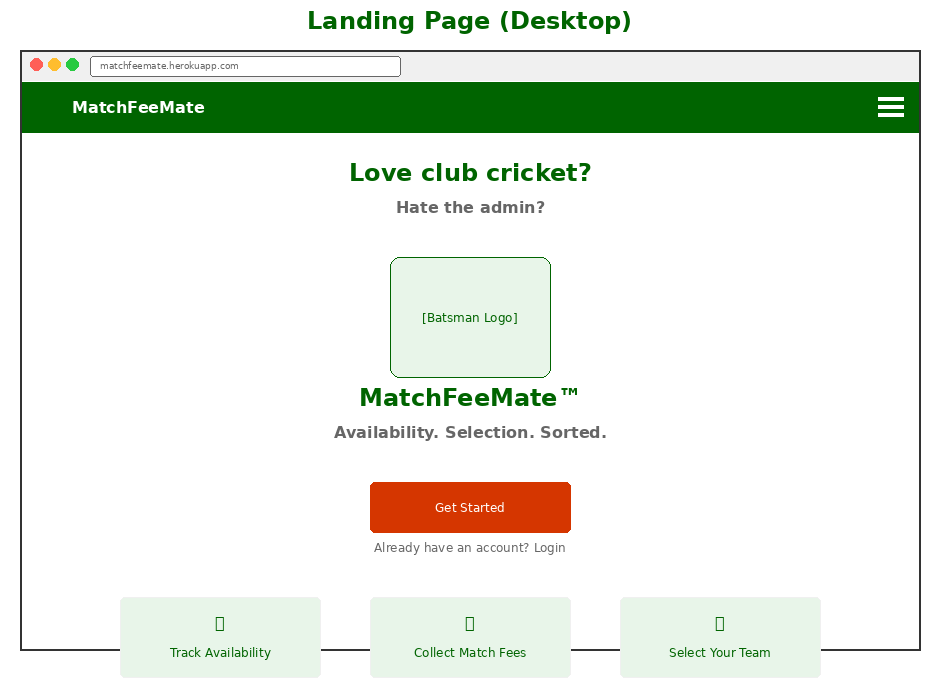 |

#### Authentication

| Login | Sign Up |
|-------|---------|
| 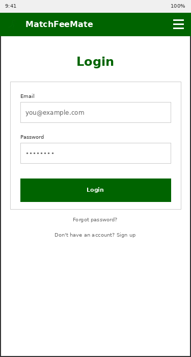 | 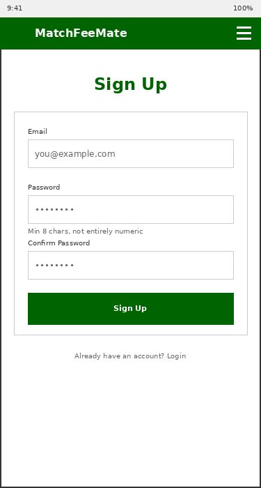 |

#### Players

| Player List | Player Form |
|-------------|-------------|
| 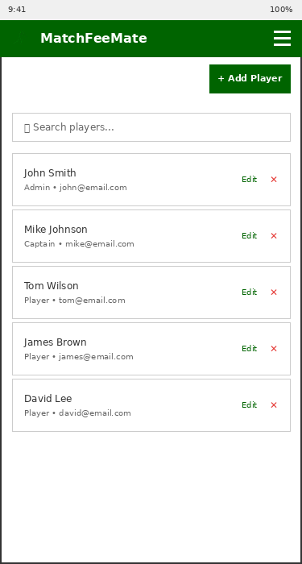 | 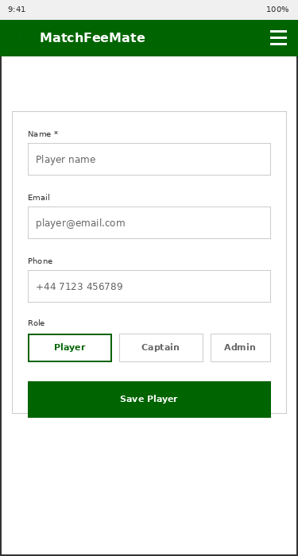 |

#### Matches

| Match List | Match Detail | Match Form |
|------------|--------------|------------|
| 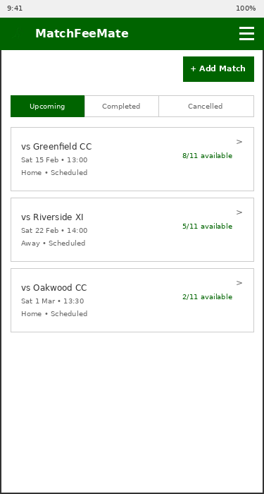 |  | 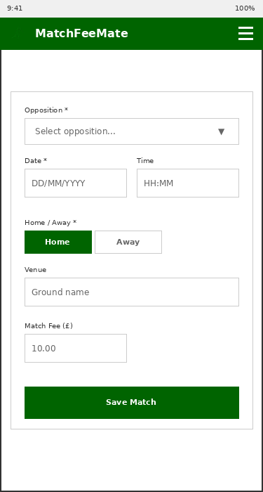 |

*The match detail screen is the operational hub - showing availability at a glance with colour-coded status indicators, and providing direct access to both availability management and team selection.*

#### Opposition

| Opposition List | Opposition Form |
|-----------------|-----------------|
| 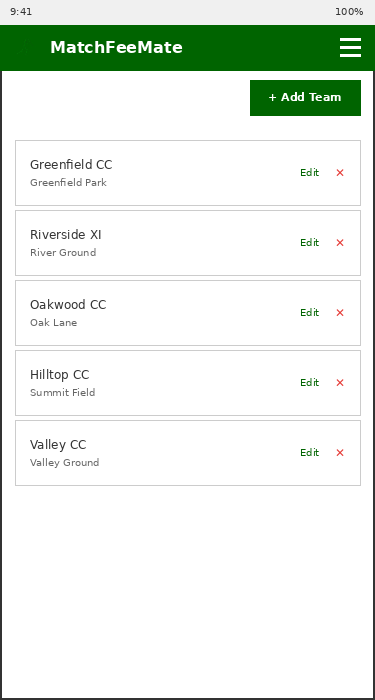 | 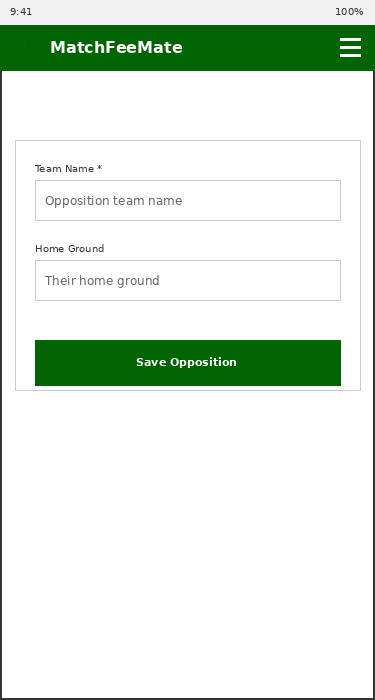 |

#### Team Selection

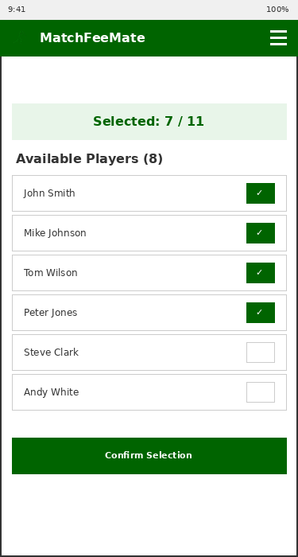

*Team selection shows only available players, with a running count of selections against the required 11.*

---

### User Flows

User flow diagrams were created to map the key journeys through the application. Grey rounded rectangles indicate handoffs to other flows.

#### Authentication Flows

| Sign Up | Login |
|---------|-------|
| 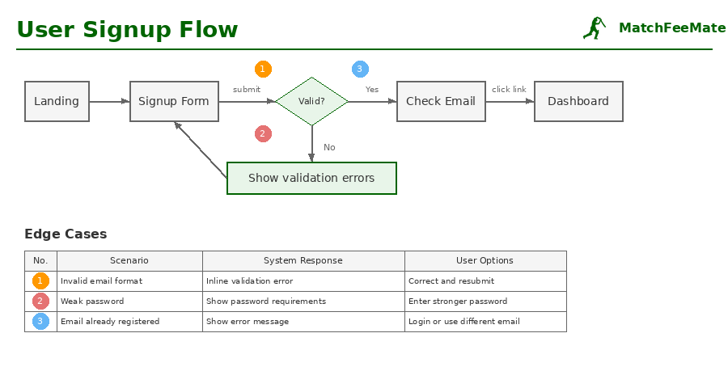 | 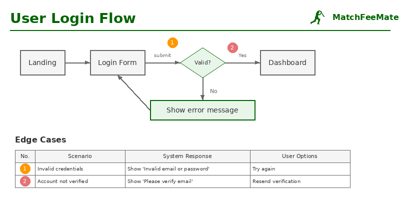 |

#### Club Management

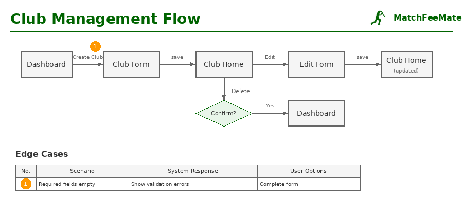

*New users are prompted to either join an existing club or create a new one.*

#### Core Management Flows

| Players | Opposition | Matches |
|---------|------------|---------|
|  | 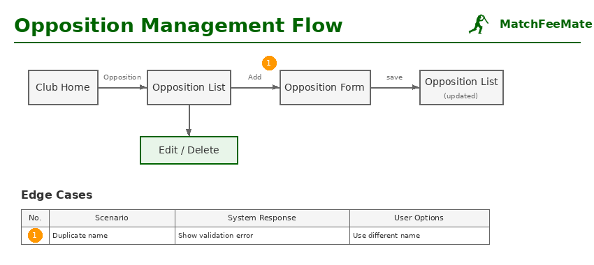 | 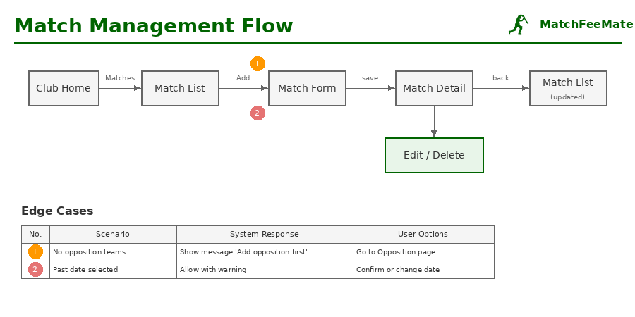 |

#### Match Day Flows

| Availability | Team Selection |
|--------------|----------------|
| 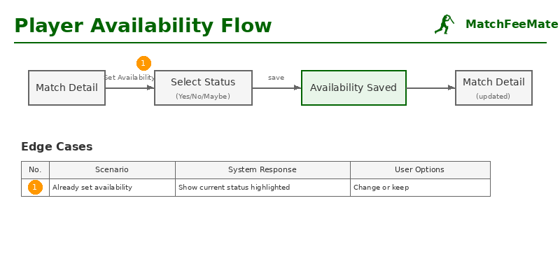 | 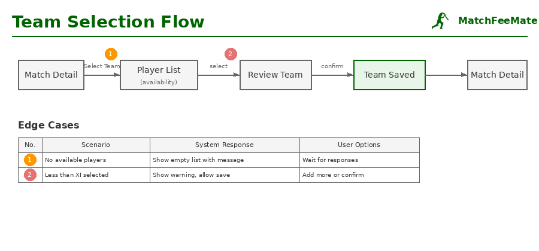 |

## Tools & Resources

### Development Tools

- [VS Code](https://code.visualstudio.com/) - Primary IDE
- [Google Docs](https://docs.google.com/) - Planning and documentation drafting

### AI Assistance

- [Claude](https://claude.ai/) - Development guidance, code review, debugging, and documentation
- [ChatGPT](https://chat.openai.com/) - Image generation, boilerplate code, and debugging support

### Design & UX Resources

- [Laws of UX](https://lawsofux.com/) - UX design principles
- [UX Movement](https://uxmovement.com/) - UX best practices newsletter
- Local rugby and cricket club websites - Competitor research and feature inspiration

### Reference Books

- *CSS in Depth, Second Edition* - Keith J. Grant
- *Python All-in-One For Dummies* - John Shovic & Alan Simpson
- *Python Crash Course* - Eric Matthes
- *HTML, CSS & JavaScript All-in-One For Dummies* - Paul McFedries