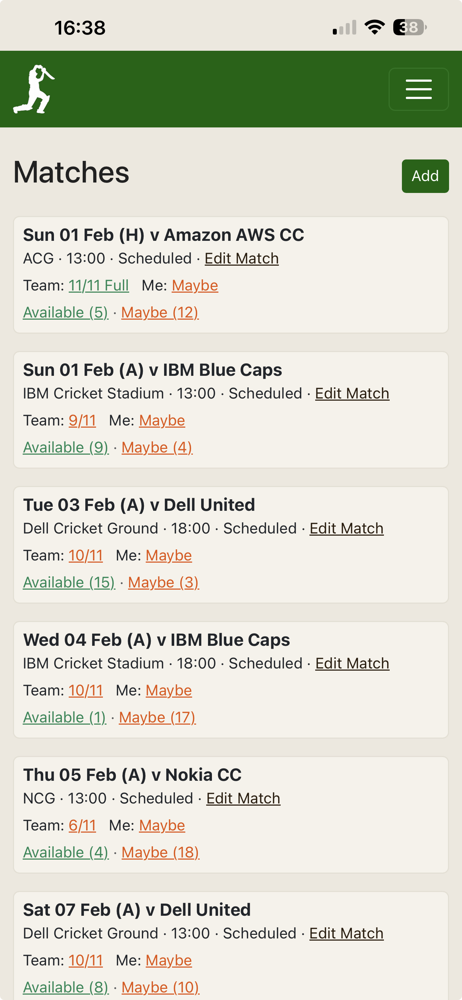
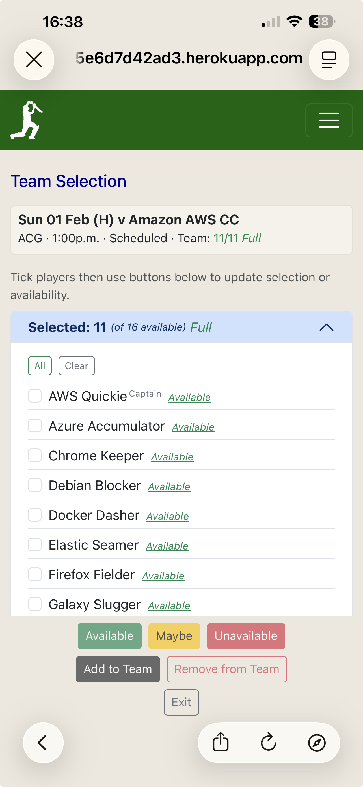
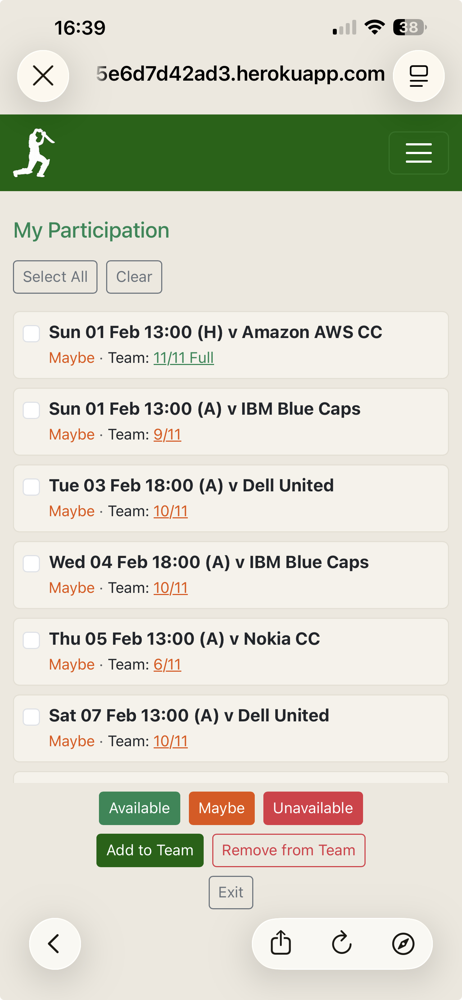

# Testing

## Table of Contents
1. [Code Validation](#code-validation)
2. [Lighthouse Testing](#lighthouse-testing)
3. [Responsive Testing](#responsive-testing)
4. [Manual Testing](#manual-testing)
5. [Bugs](#bugs)

---

## Code Validation

### HTML Validation
All pages passed the [W3C HTML Validator](https://validator.w3.org/) with no errors.

### CSS Validation
CSS passed the [W3C CSS Validator](https://jigsaw.w3.org/css-validator/) with no errors.

### Python Validation (Flake8)
All Python code passes Flake8 linting with no errors.

## Lighthouse Testing

Lighthouse audits were performed on key pages. All scores are 90+.

| Page | Performance | Accessibility | Best Practices | SEO |
|------|-------------|---------------|----------------|-----|
| Home | | | | |
| Match List | | | | |
| Team Selection | | | | |
| My Availability | | | | |

---

## Responsive Testing

The application was tested on the following devices:
- iPhone 14 (Safari)
- Google Pixel 9 (Chrome)
- Desktop (Chrome, Firefox, Edge)

### Mobile Screenshots

| Screen | Screenshot |
|--------|------------|
| Match List |  |
| Team Selection |  |
| My Availability |  |

---

## Manual Testing

### Authentication

| Test | Expected Result | Pass |
|------|-----------------|------|
| Register new account | Account created, redirected to home | ✓ |
| Login with valid credentials | Logged in, redirected to match list | ✓ |
| Login with invalid credentials | Error message displayed | ✓ |
| Logout | Logged out, redirected to home | ✓ |

### Club Management (Admin/Captain only)

| Test | Expected Result | Pass |
|------|-----------------|------|
| Create club | Club created, user set as admin | ✓ |
| Edit club details | Changes saved, success message | ✓ |
| Add player | Player added to club | ✓ |
| Edit player | Player details updated | ✓ |
| Delete player | Player removed (with confirmation) | ✓ |
| Add opposition | Opposition team added | ✓ |

### Match Management (Admin/Captain only)

| Test | Expected Result | Pass |
|------|-----------------|------|
| Create match | Match created, redirected to team selection | ✓ |
| Edit match | Match details updated | ✓ |
| Delete match | Match removed (with confirmation) | ✓ |
| Cancel match | Match status set to cancelled | ✓ |

### Availability

| Test | Expected Result | Pass |
|------|-----------------|------|
| Set own availability (Available) | Status updated, success message | ✓ |
| Set own availability (Maybe) | Status updated, success message | ✓ |
| Set own availability (Unavailable) | Status updated, success message | ✓ |
| Bulk update availability (Captain) | Multiple players updated | ✓ |
| Select All button | All players in section selected | ✓ |
| Clear button | All players in section deselected | ✓ |

### Team Selection (Admin/Captain only)

| Test | Expected Result | Pass |
|------|-----------------|------|
| Add player to team | Player moved to Selected section | ✓ |
| Remove player from team | Player moved back to availability section | ✓ |
| Team count updates | Header shows correct X/11 count | ✓ |
| Full team indicator | "Full" badge shows when 11 selected | ✓ |

### Permissions

| Test | Expected Result | Pass |
|------|-----------------|------|
| Player cannot access team selection | 403 Forbidden | ✓ |
| Player cannot edit matches | 403 Forbidden | ✓ |
| Player cannot add players | 403 Forbidden | ✓ |
| Captain can access all admin functions | Access granted | ✓ |

### Navigation

| Test | Expected Result | Pass |
|------|-----------------|------|
| Navbar links work | All links navigate correctly | ✓ |
| Back navigation | Returns to expected page | ✓ |
| Exit buttons | Return to match list | ✓ |

---

## Bugs

### Resolved Bugs

| Bug | Description | Solution |
|-----|-------------|----------|
| Maybe count mismatch | Match list showed 0 maybes when player was Maybe + Selected | Removed `selected=False` filter from count query |
| Inline styles invalid | HTML validator error for `<style>` in content | Moved all styles to static CSS file |
| Variable shadowing | Flake8 error for `match` variable shadowing import | Renamed loop variables to `current_match` and `target_match` |

### Known Issues

| Issue | Description | Planned Fix |
|-------|-------------|-------------|
| Select All includes completed matches | On availability screens, Select All checks all matches including completed/cancelled | Add warning message or filter (Future Enhancement) |

---

## Browser Compatibility

| Browser | Version | Result |
|---------|---------|--------|
| Chrome | 120+ | ✓ Pass |
| Firefox | 120+ | ✓ Pass |
| Safari | 17+ | ✓ Pass |
| Edge | 120+ | ✓ Pass |

---